@PLUGIN@ CopyCondition
======================

The @PLUGIN@ plugin provides an
additional [copy condition](https://gerrit-review.googlesource.com/Documentation/config-labels.html#label_copyCondition)
operand that can be used in label definitions to control when owner approvals should be preserved
across patch sets.

This document describes the behavior of the operand, its purpose, and how to
configure it.

## approverin:already-approved-by_owners

This operand enables approval copying based on file ownership and patch-set differences.
It allows owner approvals to be copied over if the owned files in the latest patch set haven't been
modified.

By doing so, it reduces unnecessary re-review, allowing owners to retain their previous approval
when their files are unchanged.

When evaluating a label's `copyCondition`, the operand `approverin:already-approved-by_owners`
returns true only when:

1. The approval was previously given by a user who owns at least one file in the change; and
2. The newly uploaded patch set does not modify any files owned by that user (edits due to
   rebase-only are ignored).

If a patch set updates files that the approver owns, the approval is cleared and the owner is
expected to review the new changes. However, if the modifications are identified as rebase edits,
they are treated as unchanged, and the approval is preserved.

**NOTE**: this operand is only supported for `approverin:` predicates. Using it with an `uploaderin`
predicate will result in the label **not** being copied (and an error emitted in the logs).

## Example Scenarios

Given an `OWNERS` file that splits ownerships between `frontend` users and `backend` users based on
file matchers:

```text
inherited: true
matchers:
- suffix: .js
  owners:
  - user-frontend
- suffix: .java
  owners:
  - user-backend
```

### Approval copied

* A `user-frontend` owner gives `Code-Review +2` on `Patch Set 1`.
* `Patch Set 2` updates only backend files.
* The `user-frontend` owner does not own any of the modified files in the new Patch Set.

**Result**: The `Code-Review +2` is copied forward.

### Approval copied (edits due to rebase-only)

* A `user-frontend` owner gives `Code-Review +2` on `Patch Set 1`.
* The uploader rebases the change on a different parent (e.g. a new `master` tip) that also brings
  changes to `.js` files.
* `Patch Set 2` is created. `.js` files in `Patch Set 2` are different from `Patch Set 1` (they now
  include the changes from the new parent).

**Result**: The `Code-Review +2` is copied forward.

This is because the `approverin:already-approved-by_owners` predicate ignores changes
that are marked as `due_to_rebase`. Even though the owned files in `Patch Set 2` are
different from `Patch Set 1` (due to the new parent), the content modifications are
determined to be purely from the rebase, not from new edits by the uploader.

### Approval copied (edits due to rebase-only + unrelated file modification)

* A `user-backend` owner gives `Code-Review +2` on `Patch Set 1`.
* The uploader rebases the change as in the previous example (modifying `backend.java` due to
  rebase).
* The uploader *also* includes a change to a file NOT owned by `user-backend`, in the same new Patch
  Set.

**Result**: The `Code-Review +2` is copied forward.

The modification to `backend.java` is ignored because it is exclusively "due to rebase".
The modification to `unrelated.txt` is ignored because `user-backend` does not own it.

### Note on conflict resolutions during rebase

When a rebase encounters conflicts, the resulting patch set necessarily
introduces new content edits by the uploader while resolving those
conflicts. Such changes are treated as genuine modifications, even if
they conceptually originate from upstream changes.

As a result, approvals guarded by `approverin:already-approved-by_owners`
are **not copied** across rebases that require conflict resolution.

### Approval not copied

* A `user-backend` owner gives `Code-Review +2` on `Patch Set 3`.
* `Patch Set 4` modifies a backend-owned file.

**Result**: The approval is cleared because the owner must review the new changes.

## Label configuration

The copy condition is a `label` property and as such needs to be set in the label configuration.
The following is an example of the `approverin:already-approved-by_owners` configured for the
`Code-Review` label.

```text
[label "Code-Review"]
    function = NoBlock
    defaultValue = 0
    value = -2 This shall not be submitted
    value = -1 I would prefer this is not submitted as is
    value = 0 No score
    value = +1 Looks good to me, but someone else must approve
    value = +2 Looks good to me, approved
    copyCondition = approverin:already-approved-by_owners
```

## auto-owners-approved

The `auto-owners-approved` field controls a specific exception to the default
`approverin:already-approved-by_owners` behavior. It applies when:

1. The new patch-set updates only files that are owned by the change owner.
2. The change owner, the patch-set committer and the label approver are the same person.

Under these conditions, if the `auto-owners-approved` field is set, and it applies to all files
updated in the patchset, then the vote will be copied over, whilst the normal
`approverin:already-approved-by_owners` logic would drop that owner's previous vote.

The rationale is simple: if an owner already approved a change that stays entirely within code they
own, and the next patch set is uploaded by that same owner, forcing that same person to re-apply
the same vote adds little review value.

If it is not set, it defaults to `false`.

This field can be configured at `OWNERS` file level and on individual matchers.
When a matcher defines `auto-owners-approved`, that matcher-specific value takes precedence for the
files it matches over the surrounding `OWNERS` value.

If `auto-owners-approved` is `true` for every touched file, the predicate can use that self-update
shortcut for the patch set. Otherwise, the usual `approverin:already-approved-by_owners` logic
still applies.

When a vote was copied over to the new patchset due to the  `auto-owners-approved` applying, the UI
will clearly show a dedicated icon on the UI, highlighting this.
The [examples](#auto-owners-approved-examples) section shows some screenshots of what this looks
like.

### Inheritance

The usual `OWNERS` [inheritance](./config.md#global-project-owners) logic applies to
`auto-owners-approved` as well. This includes directory `OWNERS` lookup, project `refs/meta/config`
`OWNERS`, and parent project `OWNERS` when inheritance continues up the project hierarchy.

### auto-owners-approved examples

Let's imagine a repository `main-repo` for which the `approverin:already-approved-by_owners` copy
condition logic has been configured.

The `main-repo` repo has the following `OWNERS` files configurations.

```
➜  main-repo tree
.
├── OWNERS
└── subdir
    ├── OWNERS
    └── subsub
        └── OWNERS
```

* OWNERS

The root `OWNERS` file enables `auto-owners-approved` behaviour for Java (`.java`) files, which are
owned by the `user-backend` and `user-security`.
JavaScript (`.js`) files are owned by `user-frontend` and auto-approval logic does not apply for
them, as per default.

```yaml
inherited: true
matchers:
  - suffix: .js
    owners:
      - user-frontend
  - suffix: .java
    auto-owners-approved: true
    owners:
      - user-backend
      - user-security
```

* subdir/OWNERS

The `subdir/OWNERS` file attributes ownership on the entire `subdir` directory to the `user-backend`
and _enables_ `auto-approval` behaviour at directory level.

```yaml
inherited: true
auto-owners-approved: true
owners:
  - user-backend
```

* subdir/subsub/OWNERS

The `subdir/subsub/OWNERS` file attributes ownership on the entire `subsub` directory to the
`user-backend` but _disables_ `auto-approval` behaviour at directory level.

```yaml
inherited: true
auto-owners-approved: false
owners:
  - user-backend
```

#### Example 1 - Default behavior. auto owners approval logic does NOT apply

1. The `user-frontend` adds a `.js` file and votes `+2`. The owner approval is satisfied (since
   `user-frontend` is an owner).

   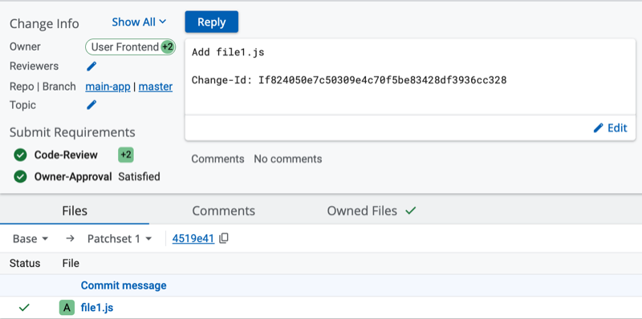
2. The `user-frontend` modifies the content of the `.js` file and uploads a new patchset. The
   approval is **not copied over**.

   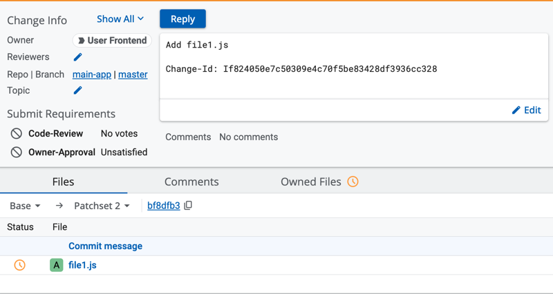

**EXPLANATION**: by default, the `auto-owners-approved` is `false`, so the standard
`approverin:already-approved-by_owners` logic applies: owned files have been modified, the vote is
not copied over.

#### Example 2 - auto owners approval logic applies: Vote is copied over to new patchset

1. The `user-backend` adds a `.java` file and votes `+2`. The owner approval is satisfied (since
   `user-backend` is an owner).

   
2. The `user-backend` modifies the content of the `.java` file and uploads a new patchset. The
   approval **is** copied over (and a special icon is displayed).

   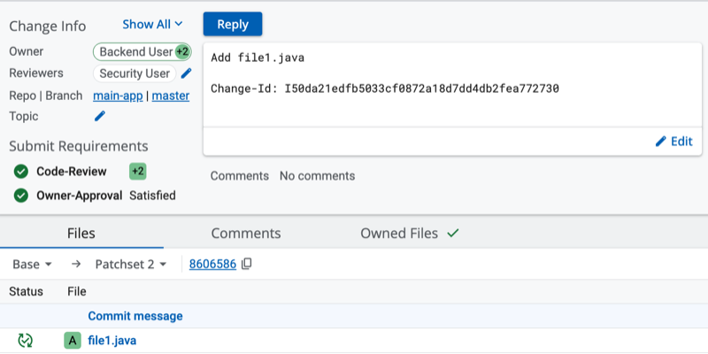

**EXPLANATION**: the root `OWNERS` file has a specific matcher that enables the
`auto-owners-approved` for `.java` files.

Since the change owner, the uploader and the approver are all the same person **and** only owned
files have been modified in the new patchset, the vote is copied over.

The UI shows a special icon to indicate that the approval was carried automatically because the
`auto-owners-approved` applied.

Since by default, the `auto-owners-approved` is `false`, this example shows the standard behavior
of the `approverin:already-approved-by_owners` copy condition logic.

#### Example 3 - Owned and non-owned files are modified. auto owners approval logic does NOT apply

1. The `user-backend` adds a `.java` file and votes `+2`. The owner approval is satisfied (since
   `user-backend` is an owner).

   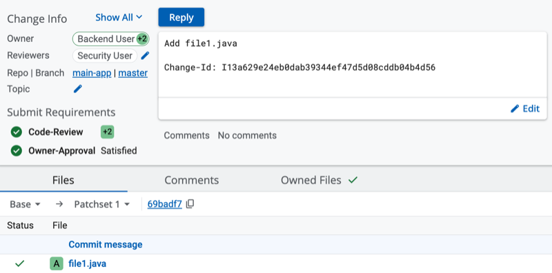
2. The `user-backend` modifies the content of the `.java` and of a `.txt` file and uploads a new
   patchset. The approval is **NOT copied over**.

   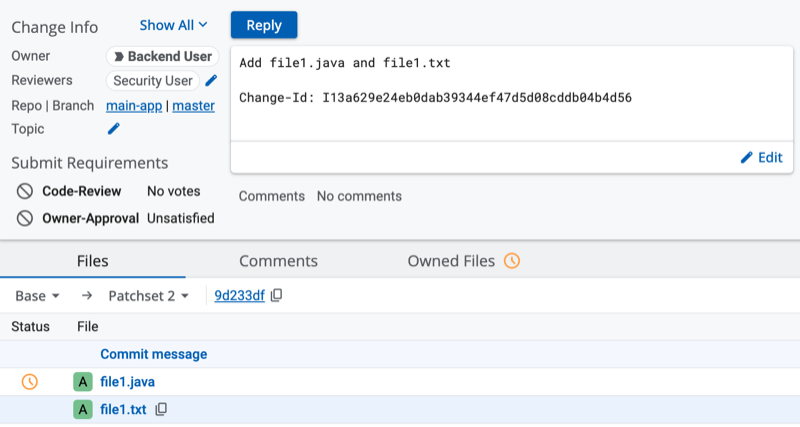

**EXPLANATION**: Even though the root `OWNERS` enables `auto-owners-approved` for `.java` files, the
change owner's new patch also touched non-owned files (the `.txt`): the conditions for which the
patch-set is eligible for auto-approval did not apply and thus the owner approval is lost.

#### Example 4 - a different owner approved the change. auto owners approval logic does NOT apply

1. The `user-backend` adds a `.java` file. `user-security` votes `+2`. The owner approval is
   satisfied (since `user-security` is also an owner of `java` files).

   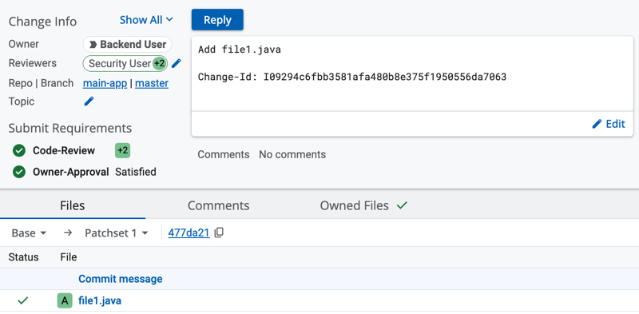
2. The `user-backend` modifies the content of the `.java` file and uploads a new patchset. The
   approval is **NOT** copied over.

   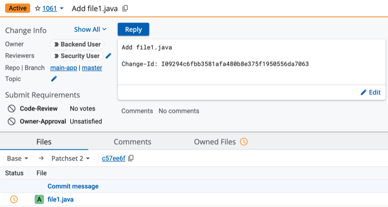

**EXPLANATION**: Even though the root `OWNERS` enables `auto-owners-approved` for `.java` files, the
approval vote was given by a _different_ owner (i.e. not by the change owner): the conditions for
which the patch-set is eligible for auto-approval did not apply and thus the owner approval is lost.

#### Example 5 - auto approval not enabled for every file. auto owners approval logic does NOT apply

1. The `user-backend` adds a file in the `subdir` file and votes `+2`. The owner approval is
   satisfied (since `user-backend` is an owner of the `subdir` directory).

   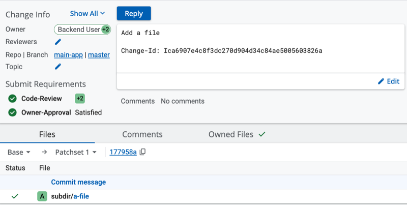
2. The `user-backend` modifies a `subdir/subsub` file and uploads a new patchset.
   The approval is **NOT copied over**.

   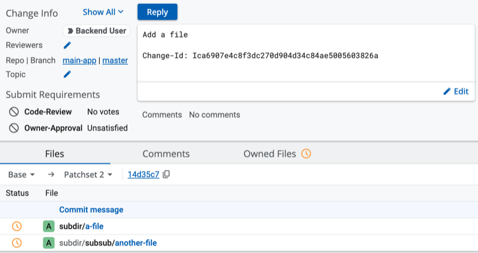

**EXPLANATION**: The `subdir/OWNERS` enables `auto-owners-approved`, whilst the
`subdir/subsub/OWNERS` disables it. Even though the change owner is the uploader and the approver of
the new patchset and only owned files have been touched, the `auto-owners-approved` flag was not
enabled for every file in the patch. the conditions for which the patch-set is eligible for
auto-approval did not apply and thus the owner approval is lost.

#### Example 6 - Explicit owner approval override. auto owners approval icon is not displayed

1. The `user-backend` adds a `.java` file and votes `+2`. The owner approval is satisfied (since
   `user-backend` is an owner).

   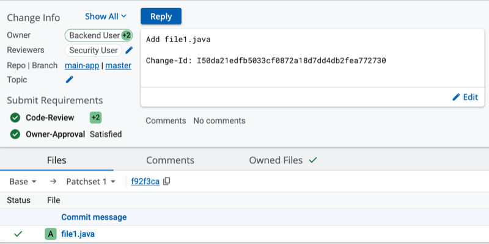
2. The `user-backend` modifies the content of the `.java` file and uploads a new patchset. The
   approval **is** copied over (and a special icon is displayed).

   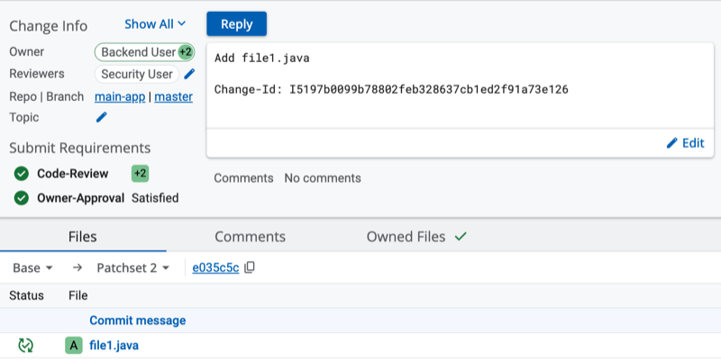
3. The `user-security` now also approves the change. The explicit approval icon is displayed.

   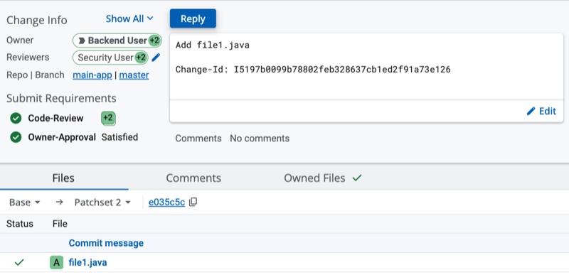

**EXPLANATION**: The auto owners approval icon
is meant to highlight the fact the patch-set was _implicitly_ approved due to the
`auto-owners-approval` logic, rather than an _explicit_ owners approval. In this context, since the
`user-security` cast an explicit approval, the special icon would be misleading, and thus it is
not displayed.
