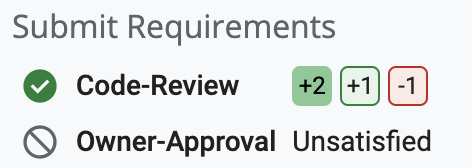
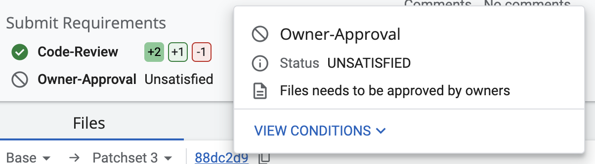
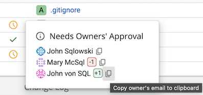
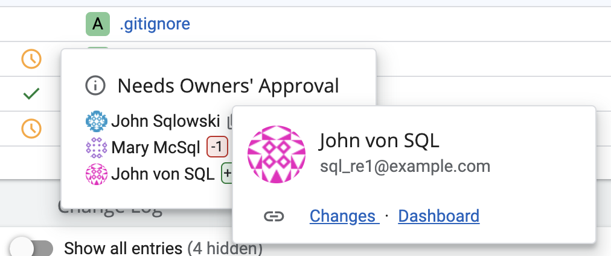
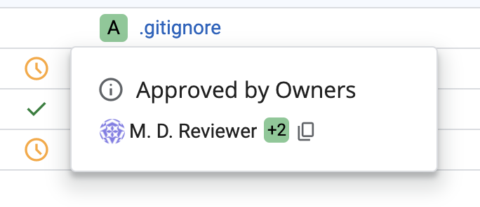
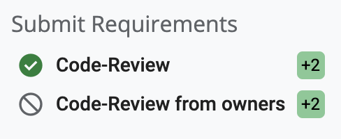
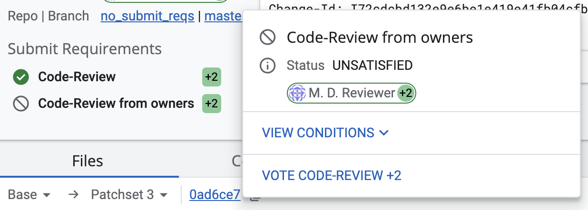

# How to use

## Intro

The `@PLUGIN@` plugin allows defining owners (individual accounts or groups)
of directories, sub-directories and files that require approval when changes
modify them.

The rules defining which user/group needs to approve which file are specified
in the `OWNERS` file and are covered in the
[@PLUGIN@ configuration](config.html) guide.

## Context

The owners plugin can be used in three different modes:
1. Prolog rules only(deprecated since Gerrit 3.6).
2. With plugin-provided submit requirements.
3. With user defined custom submit requirements.

When using the plugin in mode 1. the functionality is limited to the generation
of a Prolog-based submit rule with no extra UI features.

On top of providing significantly better and more predictable performances,
using the plugin in either mode 2. or 3. provides extra capabilities like:
- A REST-api that exposes the owners approval status with single file granularity.
- Enhanced UI experience with much clearer explanation of who owns what files,
  as explained below.

## <a id="ownerStatus">Owner status on change page

### <a id="ownerStatus.submitRequirements">Owners status for submit requirements

When either `has:approval_owners` predicate is used in a submit requirement or
[enableSubmitRequirement](config.html#owners.enableSubmitRequirement) is enabled for a
project or any of its parents and, if applicable, owners status is displayed in two ways:

* As an icon prepending the submit requirement and as a text next to it
\

Which then displays more detail information in a tooltip when hovered over.

* Next to all owned files, even if they are owned by someone else, (when the
newest patchset is selected)
\

#### <a id="ownersStatus.submitRequirement.files">Per file owners statuses

The @PLUGIN@ plugin also shows the owners statuses per file in the file list.
For each file, the owners status is shown as an icon. One can **hover over
the icon** to get additional information displayed as a tooltip.

- **Needs Owners' Approval**\
  A file owner either has not voted or voted negatively or not with sufficient
  score.
\

    > **Notes:**
    >
    > The dialog contains up to **5** first file owners returned by the
    > @PLUGIN@ plugin's REST API.
    >
    > Apart from the owner's name, their votes (if cast) and
    > `Copy owner's email to clipboard` button are shown.
    >
    > Hovering over the owner's name results in their details being displayed

    

- **Approved by Owners**\
  A file owner has approved the change.
\

    > Note that again, apart from the owner's name, their vote and
    > `Copy owner's email to clipboard` button are shown, and owner's details are
    > displayed when one hovers over the name.

### <a id="ownerStatus.submitRule">Owners status for submit rule

 `OWNERS` file can still be evaluated (without a need for the prolog
predicate being added to the project) by enabling the
[default submit requirements](config.html#owners.enableSubmitRequirement).
In this way, results of the `OWNERS` file evaluation are provided to
Gerrit's change through submit rule (as
[submit record](/Documentation/rest-api-changes.html#submit-record)) and, if
applicable, owners status is displayed:

* As an icon prepending the `Code Review from owners` submit requirement
\

    > Note that when default submit requirements are enabled, owner's votes are
    > displayed next to the `Code Review from owners` submit requirement instead
    > of its status. It is a Gerrit's core representation of submit rule.

* Next to all owned files (when the newest patchset is selected)
\

    > There is no difference in this aspect between modes.

#### <a id="ownersStatus.submitRule.owners">`Code Review from owners` submit requirement

The `Code Review from owners` (i.e. the 
[default submit requirement](config.html#owners.enableSubmitRequirement)) submit
requirement provides general information if all owned files were approved
(requirement is satisfied). When hovered, a detailed description is shown

#### <a id="ownersStatus.submitRule.files">Per file owners statuses

The owners status per file when [default submit
requirements](config.html#owners.enableSubmitRequirement) are enabled doesn't
differ from [submit requirements mode](#ownersStatus.submitRequirement.files).
