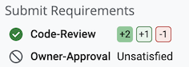
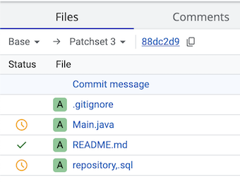
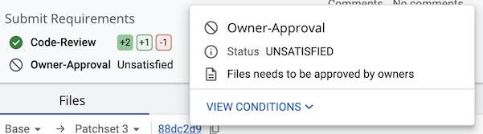
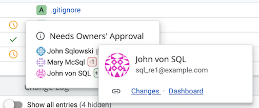
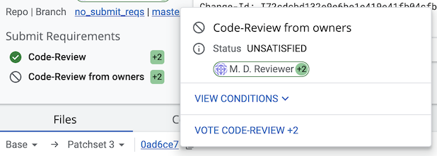

# Intro

The `@PLUGIN@` plugin allows defining owners (individual accounts or groups)
for files and requires their approval for changes that modify these files.

The rules defining which user/group needs to approve which file are specified
in the `OWNERS` file and are covered in the
[@PLUGIN@ configuration](config.html) guide.

## <a id="ownerStatus">Owner status on change page

### <a id="ownerStatus.submitRequirements">Owners status for submit requirements

When the `has:approval_owners` submit requirement is configured for a project
or hierarchy of projects (see
[configuration notes](config.html#owners.enableSubmitRequirement)) and, if
applicable, owners status is displayed in two ways:

* As an icon prepending the submit requirement and as a text next to it
\

* Next to all owned files (when the newest patchset is selected)
\

#### <a id="ownersStatus.submitRequirement.ownerApproval">`Owner-Approval` submit requirement

The `Owner-Approval` submit requirement provides general information if all
owned files were approved (requirement is satisfied). When hovered, a detailed
description is shown

#### <a id="ownersStatus.submitRequirement.files">Per file owners statuses

The @PLUGIN@ plugin also shows the owners statuses per file in the file list.
For each file, the owners status is shown as an icon. One can **hover over
the icon** to get additional information displayed as a tooltip.

- **Needs Owners' Approval**\
  A file owner either has not voted or voted negatively or not with sufficient
  score.
\

    > **Notes:**
    >
    > The dialog contains up to **5** first file owners returned by the
    > @PLUGIN@ plugin's REST API.
    >
    > Apart from the owner's name, their votes (if cast) and
    > `Copy owner's email to clipboard` button are shown.
    >
    > Hovering over the owner's name results in their details being displayed

    

- **Approved by Owners**\
  A file owner has approved the change.
\

    > Note that again, apart from the owner's name, their vote and
    > `Copy owner's email to clipboard` button are shown, and owner's details are
    > displayed when one hovers over the name.

### <a id="ownerStatus.submitRule">Owners status for submit rule

When Gerrit's submit requirement feature was not available (`3.5.x` versions),
the `OWNERS` file could still be evaluated (without a need for the prolog
predicate being added to the project) by enabling the
[replacement mode](config.html#owners.enableSubmitRequirement).
In this mode, results of the `OWNERS` file evaluation are provided to
Gerrit's change through submit rule (as
[submit record](/Documentation/rest-api-changes.html#submit-record)) and, if
applicable, owners status is displayed:

* As an icon prepending the `Code Review from owners` submit requirement
\

    > Note that in replacement mode, owner's votes are displayed next to the
    > `Code Review from owners` submit requirement instead of its status.
    > It is a Gerrit's core representation of submit rule.

* Next to all owned files (when the newest patchset is selected)
\

    > There is no difference in this aspect between modes.

#### <a id="ownersStatus.submitRule.owners">`Code Review from owners` submit requirement

The `Code Review from owners` submit requirement provides general information
if all owned files were approved (requirement is satisfied). When hovered, a
detailed description is shown

#### <a id="ownersStatus.submitRule.files">Per file owners statuses

The owners status per file in replacement mode doesn't differ from
[submit requirements mode](#ownersStatus.submitRequirement.files).
